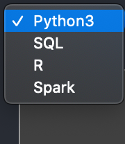
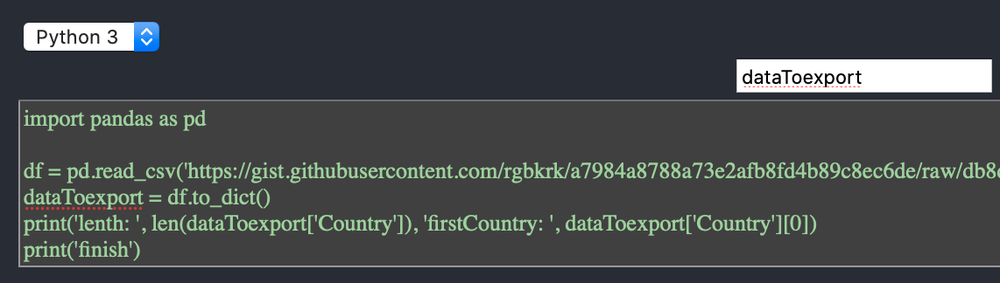
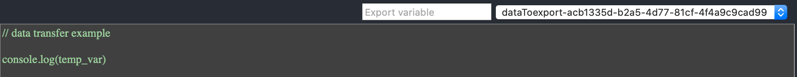
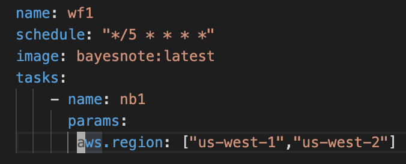
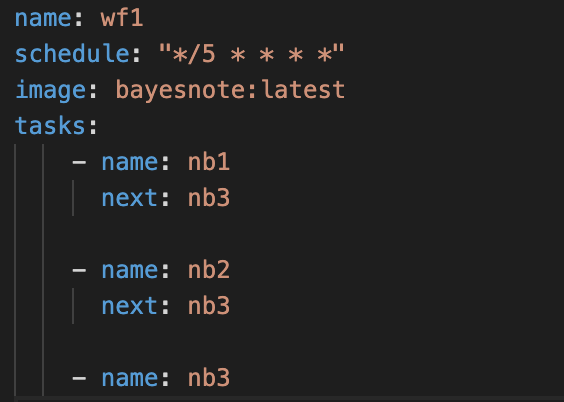

# Bayesnote: A Frictionless Integrated Notebook

Jupyter Notebook, Zeppelin Notebook and other notebooks have been highly popular among data scientists and data engineers. However, these notebooks are built with a limited goal: providing an interactive computing environment that only solves a fraction of problems of modern data teams, especially the operation of notebooks is missing. The development and operation of data application, including dashboard and machine learning model, is slow, costly and painful.

We aim to build a frictionless integrated notebook environment (INE):
- Truly end-to-end  (e.g. from spin up clusters to deliver analytics to business) 
- Combines development and operation of notebooks (e.g. run notebooks with dependency on a fixed schedule)
- Deliverable-oriented, build dashboard and deploy machine learning model right from notebooks

To achieve this goal, we build Bayesnote that introduces:
- An unified notebook layer that 
    - Supports multiple languages in one notebook with in-memory variable sharing across cells (Python, SQL, R, Scala)
    - Integrate any other notebooks, including Jupyter notebook, Zeppelin Notebook etc., as computation backend and providing APIs to be integrated by other applications (e.g. Airflow can trigger Bayesnote to run) 
- Built-in docker containers as the development and operation environment
- A workflow component built around notebooks (think about Airflow for notebooks)
- A dashboard component and a machine learning component that integrated well with notebooks.

With Bayesnote, data scientists and data engineers, at most, could become full-stack engineers with little learning costs, and at least, would be 10x less painful and 10x more productive.

*Note to users: This 0.1-alpha release is NOT ready for users, but you can request features here.* 😎

*Note to contributors: We welcome all contributors. Your contributions could bring the innovation of the engineering community to the data community.*

## Screenshots


Multi-language notebook: Select language including Spark for each cell 



Variable Sharing: Export variable from one language 


Variable Sharing: Import variable to another language


Workflow: Run notebook with parameters every 5 minutes


Workflow: Run notebook with dependency (Run nb1 and nb2 first, then nb3)


Chart: Resize


Dashboard: Drag & Drop

  

## Use cases
### Dashboard: 
- Previous: 
    - Workflow: Data scientists process data by writing Python, R and Scala in a notebook, write all their data into disk. Then they uses dashboard tool to write SQL to make charts and dashboard. 
    - Problems: 
        - Slow to develop. They have to go back and forth between notebook and dashboard tools for iteration.
        - Hard to operate. If the dashboard is refreshing everyday, and the notebook is failed to run, then a workflow system has to be set up to handle failures.
- After: 
  - Workflow: Data scientists write Python, SQL, R and scala all in one notebook. Configure workflow by YAML or UI. Done.
  - Improvements:
    - Fast to develop. All languages are supported in one notebook so no switching between notebook and dashboard tool required. Process data in-memory, saving time read and write data to disks.
    - Easy to operate. Built-in workflow system. No external workflow system (e.g. Airflow) is required to learn and operate.

### Machine learning:
- Previous:
  - Workflow: Data scientists struggles with environment, e.g loading external library into spark, switching back and forth between notebook and SQL editor, laptops and servers, losing track of model development, writing docs to explain their model, and rely on engineers to deploy their model into production.
  - Problems:
    - Slow to iterate. Dependent on others to deploy models. 
    - Difficult to operate. Lack of skills to operate machine learning infrastructure.
- After:
  - Workflow: Data scientists write all languages in one notebook. Docker containers automatically spin up based on input parameters of models and run in parallel. One-click deployment to production.
  - Improvements:
    - Fast to iterate. Saved time by experiment models in parallel on docker containers.
    - Easy to deploy. One-click deployment to production with the same docker image.

## For contributors: 

Installation:
```sh
cd Bayesnote/
yarn && lerna bootstrap
```

Set up development environment:
```sh
# watch changes in common package which is depended by other packages
cd packages/common && yarn run watch
```

```sh
# start node.js server for the unified notebook layer
cd packages/node && yarn run watch && yarn run dev
```

```sh
# start frontend
cd packages/browser && yarn start
```

```sh
# start Bayesnote flow backend service written in go.
cd flow && go run .
```

```sh
# start dashboard development
cd packages/dashboard && yarn run start
```
