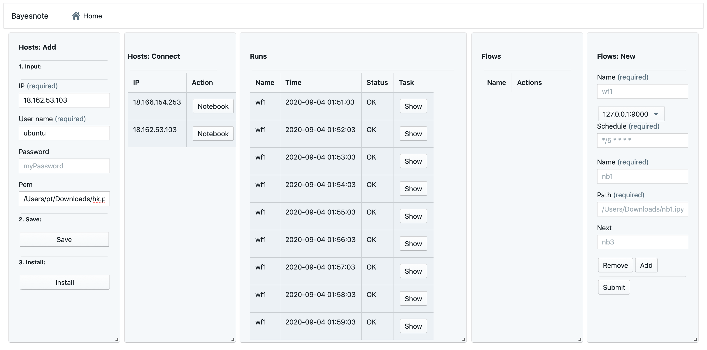
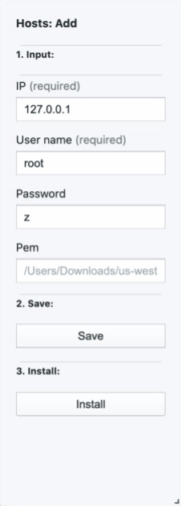
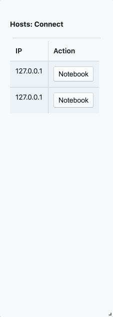
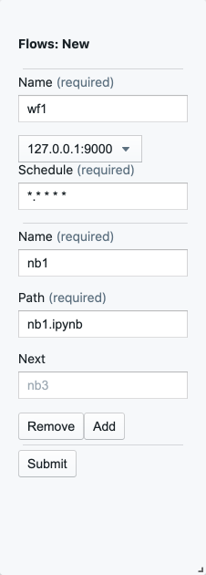
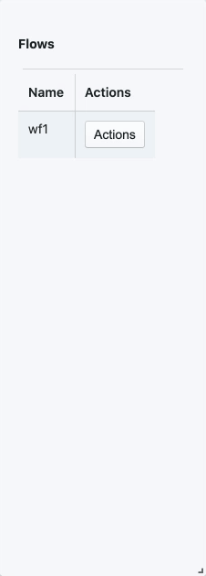
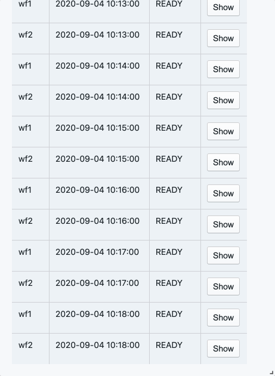
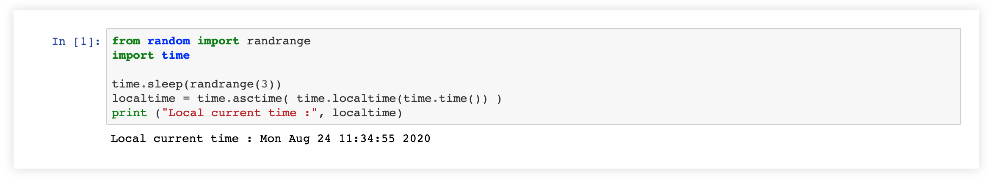

# Bayesnote
Bayesnote is a notebook orchestration platform for Jupyter notebook:
-  Orchestrate notebooks on different clusters within 5 minutes
-  One-button access to remote Jupyter notebook
-  Run Jupyter notebooks with dependency and retry
-  View output notebook with one-button

# Why:

- No learning curve. There is no abstraction to learn, no docker/Kubernetes knowledge is required.

- No operation cost. There is no extra database to install, no ports to open. It can install itself into clusters without hassles.

# Screenshots

# Installation
1. Download for your operation system https://github.com/Bayesnote/Bayesnote/releases
2. Open terminal && Assign permissions `chmod 777 bayesnote`
3. Go the download folder && Run in the terminal `./bayesnote`
4. MacOS user only: Go to "Settings"-> "Security & Privacy"-> "Allow" -> "Open"

The web browser would open at `localhost:8080`.

# Tutorial

## Hosts: 
0. Make sure Jupyter notebook is already installed on the host
1. Add the host you want to run your notebook by SSH credentials
2. Open remote notebook with one-click and the browser will open Jupyter notebook on a random port.
3. Start writing code `print("Hello bayesnote")`

## Flows:
1. Create a new flow. Add depdency in next.
2. Click Start.
3. View the notebook by click show. The browser would open a new tab to show output notebook.

## How to view output:
- Click Show -> Click Notebook

### Ariticles:
[Orchestrate Jupyter Notebooks in 5 minutes](
https://medium.com/@josephtengpeng/how-to-orcestrate-jupyter-notebooks-752aa8081208?source=friends_link&sk=822a3762328a807f321f294782bf489a")

Note: This project is adding new features fast.

Note: I am working on this project full-time. Let me know what do you think. Questions, Comments, feature requests, and Pull requests welcome.