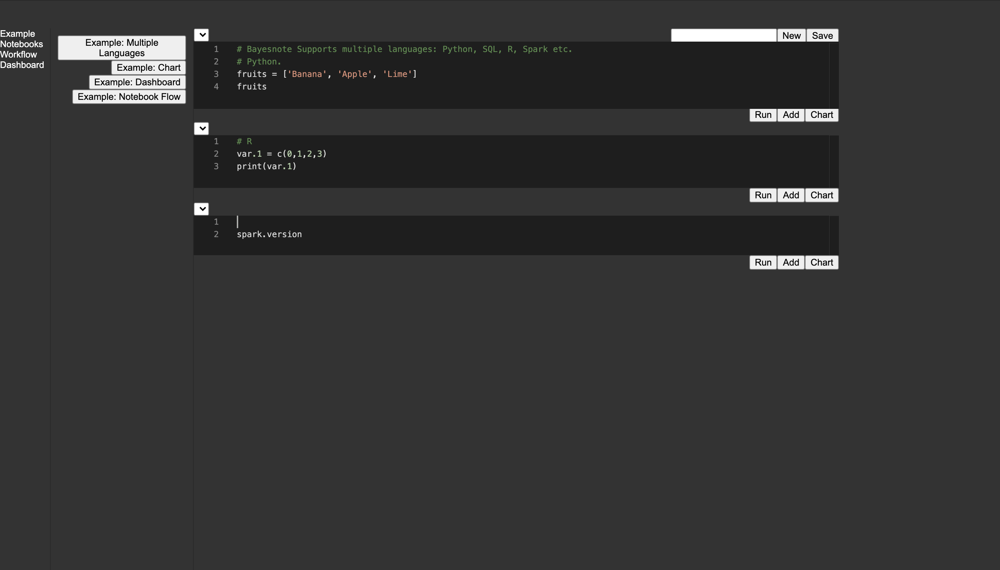
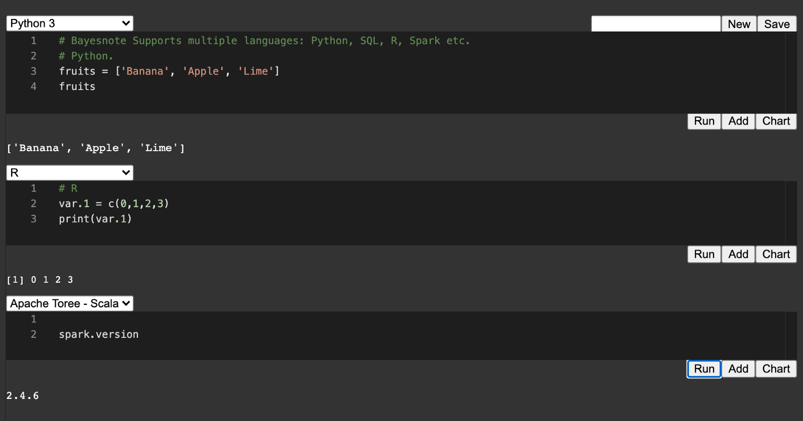
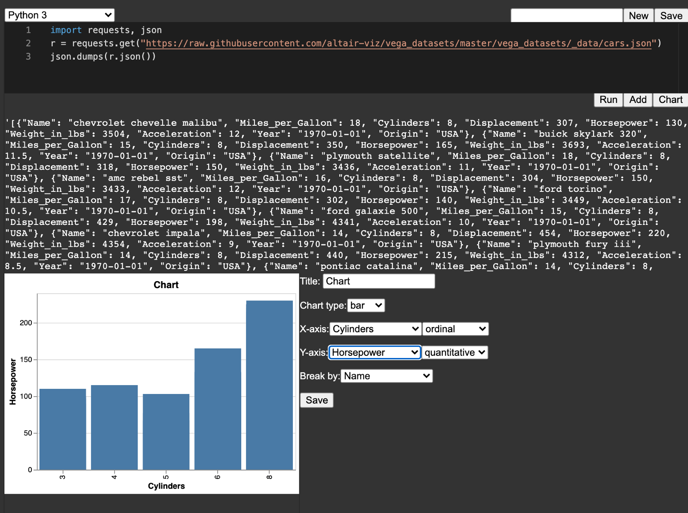
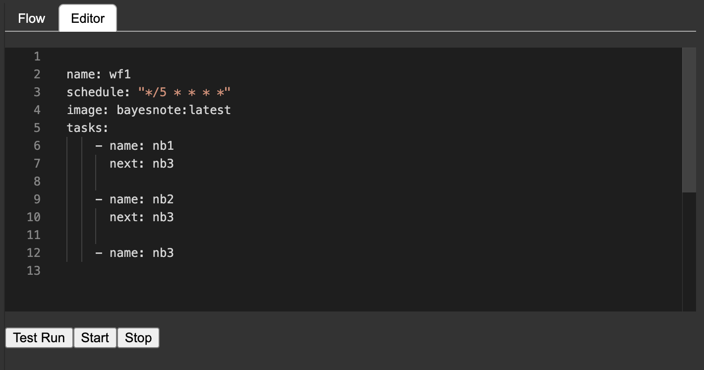
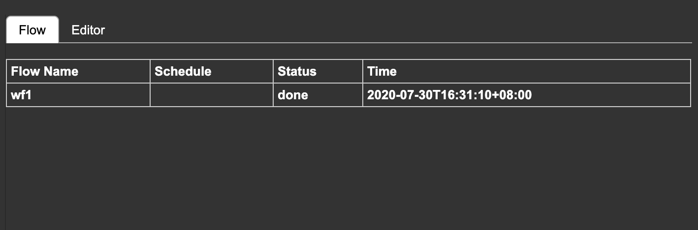

# Bayesnote: A Frictionless Integrated Notebook

Bayesnote is a frictionless integrated notebook environment for data scientists and data engineers. It provides a user interface to build dashboards and deploy machine learning models right from a notebook. It also supports the operation of notebooks by a workflow system, Noteflow. It manages servers, libraries, and containers for development and production.

# Architecture:
Bayesnote is consisted of
1. Unified Notebook Backend. It is designed to reuse the computation engine by integrating with existing notebooks, like Jupyter notebook and Zeppelin notebook, and to be integrated by other apps like Apache Airflow by exposing notebook operations, e.g. run/interrupt, as REST APIs.
2. Noteflow. It is a workflow system built for notebooks rather than functions. The dependency of notebooks, called Noteflow, is specified in YAML and triggered by cron or events. It is written in Go rather than Python to make it easier for developers/contributors to maintain and easier for users to deploy.
3. Dashboard component. It enables data scientists to process data in a notebook with Python, SQL, R and Spark, and build dashboards right from the notebook.
4. Machine Learning component(under development). It provides one-click deployment to production right from the notebook.
5. Container component. It automates common tasks of managing containers for notebook users for environment isolation and deploy to production.

# Experimental Features:
Bayesnote also introduces experimental features into the notebook itself:
1. Multiple language support. Write Python, SQL, R, and Spark in one notebook by selecting a language for each cell of the notebook.
2. Variable sharing. Variables in different languages in one notebook would be automatically shared across cells.

# Screenshots

Notebook



Write Python, SQL, R, and Spark in one notebook. Users can select a language for each cell and get results printed.


Make chart rights from notebook.


Build dashboards by drag & drop.


Define workflow by a YAML file. In this example, the name of the workflow is "wf1", the schedule is "every 5 minute" in cron expression. The optional "Image" field refers to docker image used for running notebooks. The noteflow: Run notebook "nb1" and "nb2" first; If all are successful, run notebook "nb3".
(The user interface for defining workflow is under development.)


All scheduled workflows are displayed under "Flow" tab.



Bayesnote is a new project and under active development.

## For contributors/early-adopters: 

Installation:
```sh
cd Bayesnote/
yarn && lerna bootstrap && lerna add @bayesnote/common
```

Set up development environment:
```sh
# watch changes in common package which is depended by other packages
cd packages/common && yarn run watch
```

```sh
# start node.js server
cd packages/node && yarn run dev
```

```sh
# start frontend
cd packages/browser && yarn start
```

```sh
# start Bayesnote flow backend service in golang.
cd flow && go run .
```
